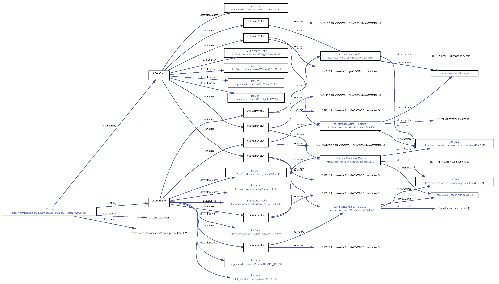

## ToxBank processed RDF dataset conversion

</img>

### Example in [RDF/XML](toxbankdataset.rdf)

Classes to convert tab-delimited processed data matrix to RDF (example N3 output below).


````
<http://example.org/9fca39fa-cdc6-42e4-a2f1-ffe5f7d7229f>
        a             ot:Dataset ;
        ot:dataEntry  [ a                ot:DataEntry ;
                        isa:hasProbe     <http://onto.toxbank.net/isa/Affymetrix/8063337> ;
                        ot:values        [ a           ot:FeatureValue ;
                                           ot:feature  <http://onto.toxbank.net/isa/qvalue/e7c430a7-f074-4703-b43d-1b7db3d80042> ;
                                           ot:value    "0.34324"^^<http://www.w3.org/2001/XMLSchema#double>
                                         ] ;
                        ot:values        [ a           ot:FeatureValue ;
                                           ot:feature  <http://onto.toxbank.net/isa/FC/8bf11cea-42ea-48dd-b027-11993b0101be> ;
                                           ot:value    "3.1415"^^<http://www.w3.org/2001/XMLSchema#double>
                                         ] ;

                        skos:closeMatch  <http://onto.toxbank.net/isa/Entrez/441951> , 
                        				 <http://onto.toxbank.net/isa/Symbol/C20orf199> , 
                        				 <http://purl.uniprot.org/uniprot/Q5QHF1> , 
                        				 <http://onto.toxbank.net/isa/RefSeq/NR_003605> , 
                        				 <http://onto.toxbank.net/isa/Unigene/Hs.356766>
                      ] ;
        ot:dataEntry  [ a                ot:DataEntry ;
                        isa:hasProbe     <http://onto.toxbank.net/isa/Affymetrix/8063634> ;
                        ot:values        [ a           ot:FeatureValue ;
                                           ot:feature  <http://onto.toxbank.net/isa/FC/8bf11cea-42ea-48dd-b027-11993b0101be> ;
                                           ot:value    "-0.878"^^<http://www.w3.org/2001/XMLSchema#double>
                                         ] ;
                        ot:values        [ a           ot:FeatureValue ;
                                           ot:feature  <http://onto.toxbank.net/isa/qvalue/e7c430a7-f074-4703-b43d-1b7db3d80042> ;
                                           ot:value    "0.87989"^^<http://www.w3.org/2001/XMLSchema#double>
                                         ] ;
                        skos:closeMatch  <http://onto.toxbank.net/isa/Unigene/Hs.280135> , 
                        				 <http://onto.toxbank.net/isa/Entrez/79160> , 
                        				 <http://onto.toxbank.net/isa/Symbol/MGC4294> , 
                        				 <http://onto.toxbank.net/isa/RefSeq/ENST00000419204>
                      ] .


<http://onto.toxbank.net/isa/FC/8bf11cea-42ea-48dd-b027-11993b0101be>
        a             ot:NumericFeature , ot:Feature ;
        dc:title      "FC[5-15 vs 5-5]" ;
        ot:hasSource  <http://example.org/X2> ;
        owl:sameAs    isa:FC .

<http://onto.toxbank.net/isa/qvalue/e7c430a7-f074-4703-b43d-1b7db3d80042>
        a             ot:NumericFeature , ot:Feature ;
        dc:title      "q[5-15 vs 5-5]" ;
        ot:hasSource  <http://example.org/X2> ;
        owl:sameAs    isa:qvalue .

````


## Java class defining ISA2RDF OWL classes and properties.

### ISA.java  
